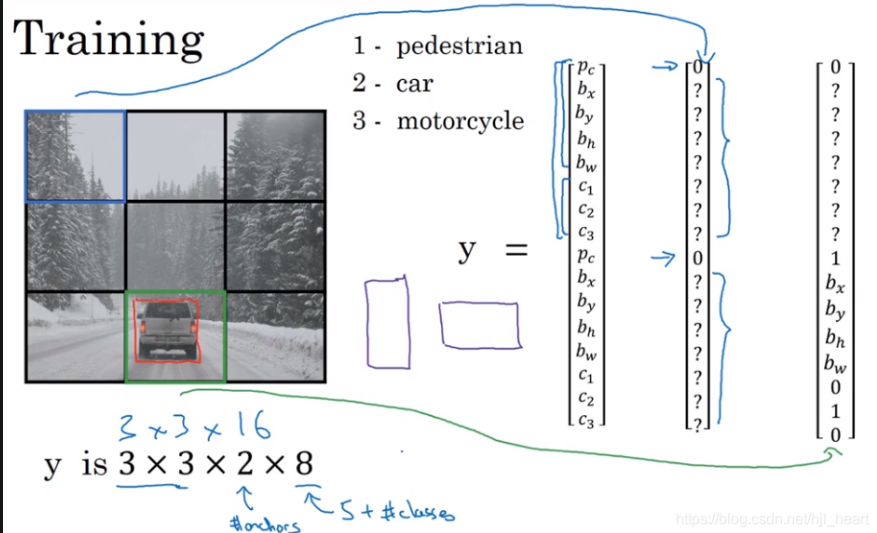

## bounding box:

图片划分为3*3的网格(grid cells),设置有两个anchor boxes(即，图中那两个紫色边框)。
这样每次检测一个grid cell，就会输出一个向量y = [Pc, bx, by, bh, bw, c1, c2, c3, Pc, bx, by, bh, bw, c1, c2, c2]。
对这个y可以这么看，由于anchor box有两个，所以y中元素数量是2 * 8。其中前一部分的(Pc,bx,by,bh,bw,c1,c2,c3)，Pc表示anchor box1是否在grid cell中检测到目标(若无，则Pc=0，后面的就不用填了)，(bx,by,bh,bw)则是目标的bounding box的位置参数，(c1,c2,c3)是目标是哪类。

----------

### bounding box地址：
https://blog.csdn.net/hjl_heart/article/details/109389619