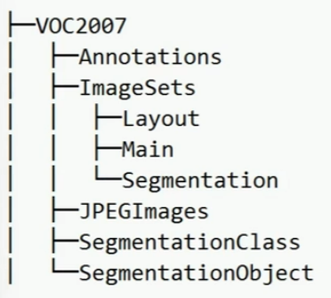

-------

* # 文件
```python
"ImageSets": 存储与图像集合相关的文件，可以根据
             不同的任务或用途进行子文件夹的分组
"Layout":存储与布局相关的图像集合文件
"Main": 存储主要的图像集合文件，可能包含训
        练集、验证集和测试集的图像索引等信息，
"Segmentation": 存储与语义分割任务相关的图
                像集合文件，可能包含训练集、验证集和测试集图像素引等信息
```
  * ## Annotations
```python
"folder": 图像所在的文件夹
"filename": 图像的文件名.
"source":图像的来源信息，包括数据库、注
         释、图像来源和唯一标识符 (flickrid)
"owner": 图像的所有者信息，包括唯一标识符
         (f1ickrid)和所有者姓名
"size":图像的尺寸信息，包括宽度、高度和深度(通道数)
"segmented": 是否进行了分割
             (segmentation)，0表示未分割，
"object":目标的标注信息，包括目标的类别
         姿势、截断情况、是否困难以及边界框的坐标信息，
         每个"object”标签表示一个目标，并包含以下子标
"name": 目标的类别名称，
"pose": 目标的姿势
"truncated": 目标是香被截断，0 表示未截
"difficult": 目标是否难以识别，8表示易识
"bndbox":目标的边界框信息，包括左上角和右下角的坐标，
``` 
  * ## ImageSets
    * ### Layout 
    * ### Main
    * ### Segmentation
  * ## JPEGImages (jpg格式图片)
  * ## SegmentationClass
  * ## SegmentationObject
