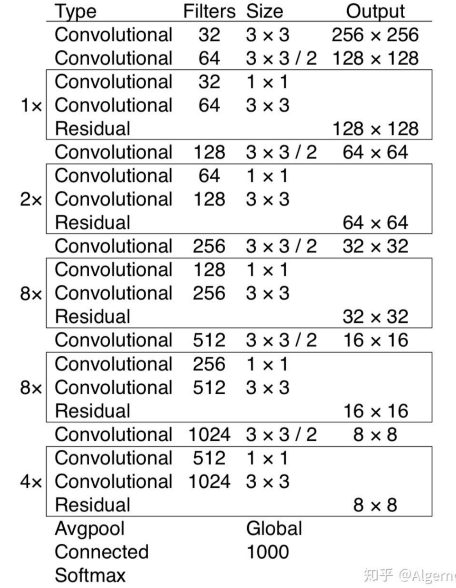
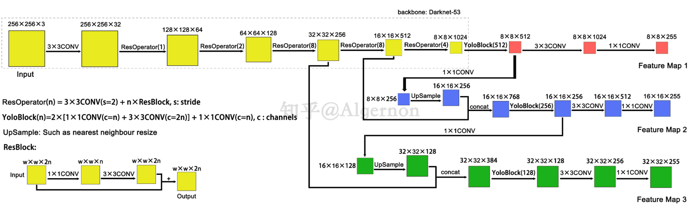

### 网络结构
backbone: Darknet-53


--------

### 检测匹配

```
每个检测框与设定的三个框进行IOU比较 与设定的IOU进行比较选取框
```

--------------------

### Anchors模版（聚类得到）

* 1.小尺度 10+13 16+30 33+23
* 2.中尺度 30+61 62+45 59+119
* 3.大尺度 116+90 156+198 373+326
  
-------------------

### 数据流图




