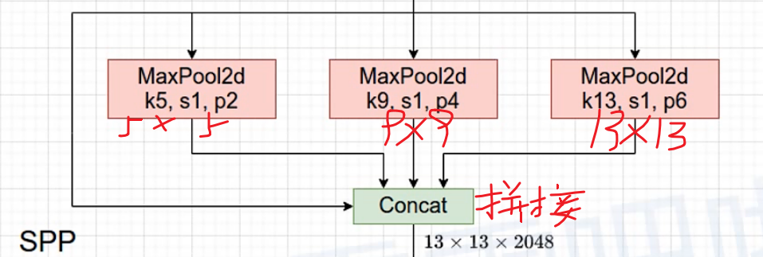
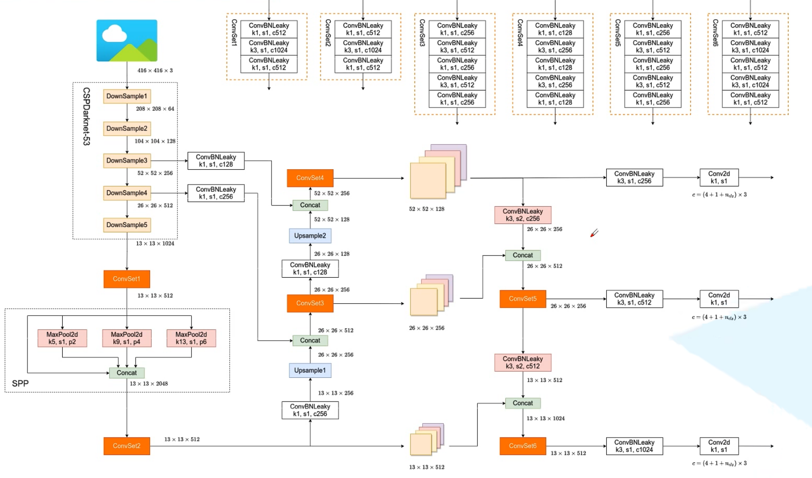

### 网络结构
```网络结构
1.Backbone：CSPDarknet53
2.Neck：SPP,PAN
3.Head：YOLOv3
```
----------------

### SPP结构


----------------

### Anchors模版（512+512）

* 1.小尺度 12+16 19+36 40+28
* 2.中尺度 36+75 76+55 72+146
* 3.大尺度 142+110 192+242 459+401

----------------

### 网络模型图

