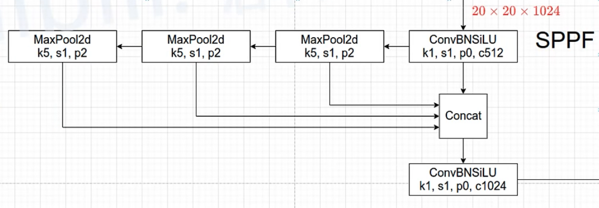
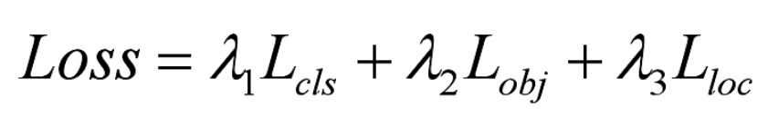

### 网络结构
```网络结构
1.Backbone：New CSPDarknet53
2.Neck：SPPF,New CSP-PAN
3.Head：YOLOv3 Head
```

-----------------------

### SPPF结构



-----------------------

### 损失

* 1.Classess loss，分类损失，采用的是BCE loss，只计算正样本的分类损失
* 2.Objectness loss，obj损失，采用的依然是BCE loss，注意这里的obj指的是网络预测的目标边界框与GT Box的CIoU。这里计算的是所有样本的obj损失
* 3.Location loss，定位损失，采用的是CIoU loss，只计算正样本的定位损失。


