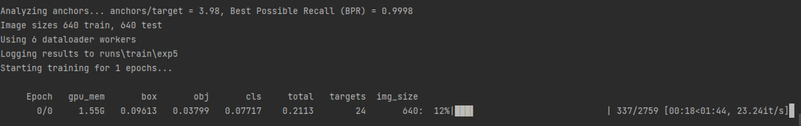
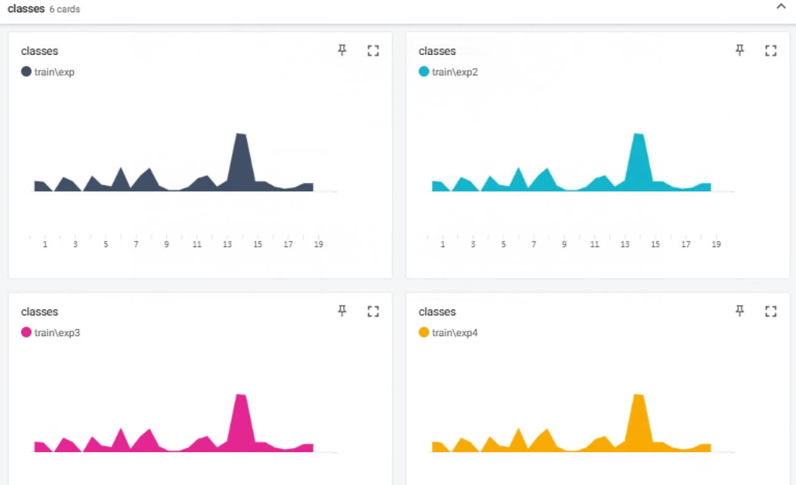

# 使用VOC数据集进行训练（yolov5s_voc）

### 权重文件
```
weights下加入权重文件
yolov5l/m/s/x.pt文件
```

### 文件配置
```
voc.yaml
train: VOC/images/train/ # 16551 images
val: VOC/images/val/ # 4952 images

# number of classes 标签数
nc: 20 

# class names 类型名称
names: [ 'aeroplane', 'bicycle', 'bird', 'boat', 'bottle', 'bus', 'car', 'cat', 'chair', 'cow', 'diningtable', 'dog',
         'horse', 'motorbike', 'person', 'pottedplant', 'sheep', 'sofa', 'train', 'tvmonitor' ]  

yolov5s.yaml
nc: 20  # number of classes

```

-------------

### 数据集文件
```
images（图片）+label（标签）文件
images下包含训练集和测试集
label下包含训练集和测试集
```

-------------

### 开始训练
```
python train.py --data data/voc_new.yaml --cfg models/yolov5s_voc.yaml --weights weights/yolov5s.pt --batch-size 6 --epochs 1 
```
> 结果如下


------------
### 训练结果
------------
```
tensorboard --logdir=./runs
```
> 结果如下


